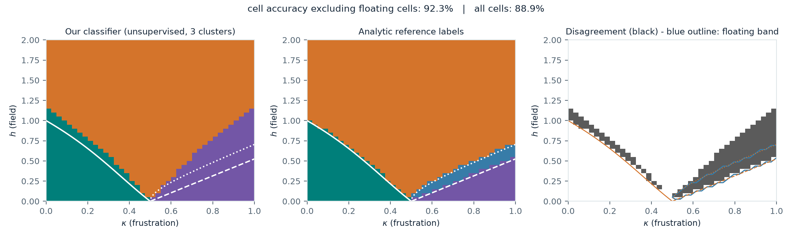
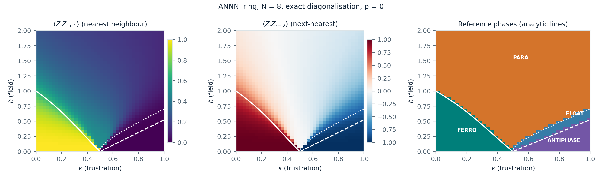
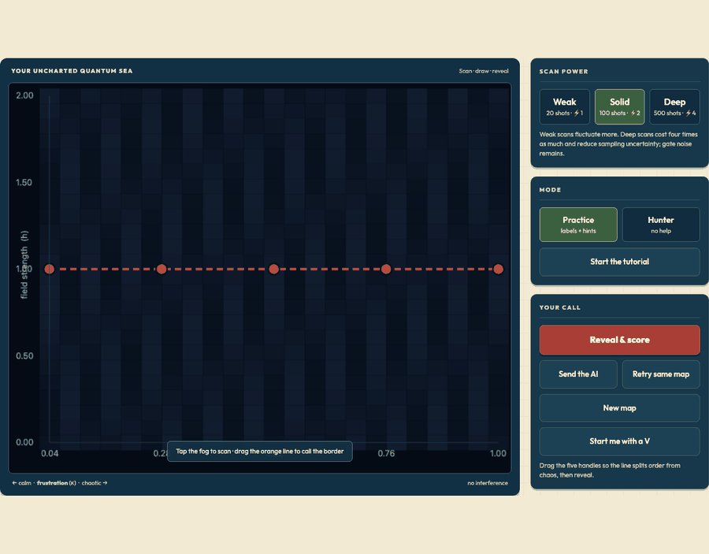
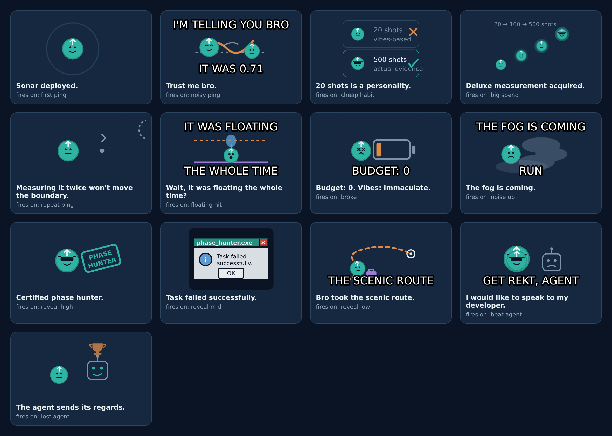
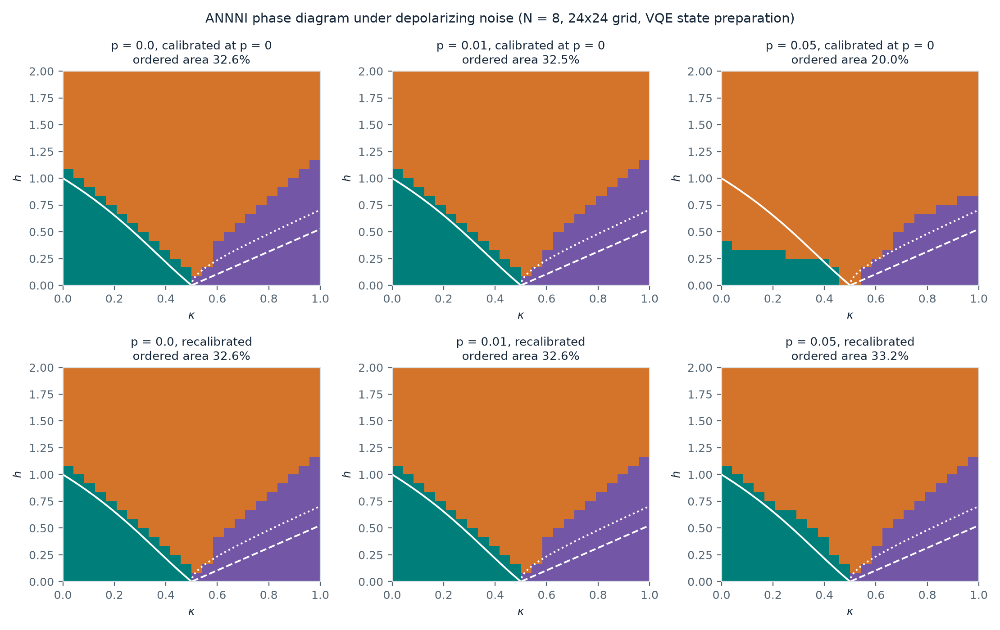
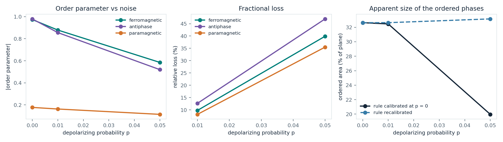
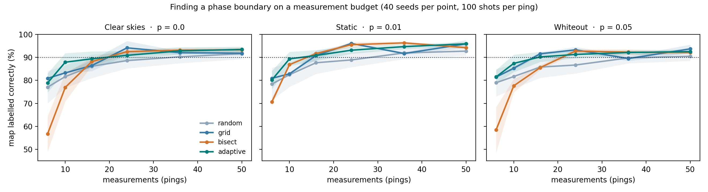

# Phase Hunter

**Q-SITE 2026 Open Challenge — Scientific Track (Quantum Coalition): mapping the ANNNI phase diagram under noise.**

Phase Hunter turns the challenge into a game. The (κ, h) phase diagram starts hidden under fog. You
spend a budget of *pings* — simulated measurements, with real shot noise — then draw where you think
the phase boundaries are, and the game scores your map against the analytic reference boundaries. An
AI agent plays the same map with the same budget. Each level raises the gate noise, so the phases
blur and shift while you hunt.

The game is the presentation layer. Underneath it is the required science: phase diagrams at
p = 0, 0.01 and 0.05, and an analysis of how noise moves the boundaries.

> **Status: draft submission (Sept 23, 2026).** The clean phase diagram and the playable prototype are
> done and reproducible from this repo. The noisy phase diagrams are not done yet — see
> [What is not done](#what-is-not-done-yet). Nothing in this README is a claimed result unless a
> script in this repo produced it.

---

## Current results

### Clean phase diagram (p = 0), N = 8 ring, exact diagonalisation



1600 ground states on a 40 × 40 grid over κ ∈ [0, 1], h ∈ [0, 2], solved in about **12 s**. Phases are
assigned by unsupervised clustering of two measured correlators, ⟨Z_i Z_{i+1}⟩ and ⟨Z_i Z_{i+2}⟩,
with the three cluster centres seeded at three corners of the plane whose phase is not in doubt. The
reference labels come from the analytic transition lines in the challenge handout.

| Metric | Value |
|---|---|
| Cell accuracy, floating band excluded | **92.3 %** |
| Cell accuracy, all cells (floating counted as an error) | 88.9 % |
| Cells inside the reference floating band | 3.6 % |

The disagreement is not scattered: it is a band just *above* the analytic lines, where our N = 8 ring
still shows order that the thermodynamic-limit formulas say has gone. That is the expected finite-size
rounding of a transition, and the handout warns the reference lines are qualitative at finite N. We
report it rather than tuning the classifier to match the lines.



### Playable prototype



*A real round, recorded from the prototype: cheap pings, two sharp ones, dragging a boundary, then the
reveal.*

Open `game/index.html` in a browser — no server, no build step. Click the map to ping, drag the orange
handles to draw your boundaries, press **Reveal & score**. Ping readings are drawn from the exact
ground-state statistics with Gaussian shot noise of size σ/√shots, so a 20-shot ping really can
mislead you and a 500-shot ping really is sharper.

**Run agent** plays a bisection baseline: for each of eight κ columns it pings at the midpoint in h,
asks whether the state still looks ordered, and halves the interval. In two test runs it used 24 pings and scored
**90.3 %** and **93.6 %** (the spread is shot noise). Those are two runs of a baseline, not a study —
the human-versus-agent measurement-budget experiment is still to come.

### Reactions (the meme layer)




Spinny, our spin-arrow mascot, reacts to what just happened, and each card is a drawn scene rather
than a caption on its own. A ping landing more than two standard deviations from the truth gets
*"Trust me bro"* over a wobbling measurement, with the reading and the true value printed underneath.
Five cheap pings in a row gets a two-panel *"20 shots is a personality"*. A ping inside the floating
band gets Spinny drifting on a balloon between the two boundary lines. Beating the agent gets the
sunglasses; losing to it gets the robot holding the trophy. Revealing your map also prints a result
panel worth screenshotting.

All thirteen cards fire on real game state, so the joke doubles as feedback about the run.

**Everything is original art.** The mascot, the props and the captions are ours, drawn as inline SVG
in `game/memes.js`. We ship no copyrighted meme images, no photographs, and no real person's likeness
— which matters for a public repo. Cards appear one at a time, are dismissible, auto-hide after four
seconds, honour `prefers-reduced-motion`, and can be switched off with the **Memes** toggle. The art
animates with CSS rather than shipping video: sonar rings pulse, fog drifts, the balloon bobs, the
stamp lands. `scripts/make_gifs.py` records the GIFs above straight from the running game, so they are
never out of date with the code.

### Noisy phase diagrams (p = 0, 0.01, 0.05), N = 8



576 points on a 24 x 24 grid. At each one a hardware-efficient ansatz is fitted to the ground state on
`default.qubit`, then the same circuit is run on `default.mixed` with a depolarizing channel after
every CNOT. Fits are checked against exact diagonalisation and refitted when they land too high:
mean energy error 0.149 (1.5% of |E|), max
0.323, and the prepared state reproduces the exact correlators to
0.027 (distance 1) and 0.042 (distance 2).

**The headline result is the top row against the bottom row.** Both show the same noisy data. The top
uses a decision rule calibrated on the clean simulation; the bottom re-fits the rule on the noisy data
itself.

| | p = 0 | p = 0.01 | p = 0.05 |
|---|---|---|---|
| Ordered area, rule calibrated at p = 0 | 32.6% | 32.5% | **20.0%** |
| Ordered area, rule recalibrated | 32.6% | 32.6% | **33.2%** |
| Agreement with the analytic boundaries (recalibrated) | 92.2% | 92.2% | 91.7% |

Read with a fixed rule, the ordered phases lose 39% of
their area by p = 0.05. Recalibrated, they do not move at all. Depolarizing noise attenuates the
correlators almost multiplicatively, so it destroys the *scale* of the order parameter but not the
*location* of the transition. What noise really costs you is signal-to-noise, and therefore shots.



**Which phase is most fragile.** Deep inside each region, the fractional loss of the order parameter
at p = 0.05 is 47% for the antiphase against
40% for the ferromagnet. The antiphase is carried by the
next-nearest-neighbour correlator, a longer-range object than the ferromagnet's nearest-neighbour one,
so the same per-gate error costs it more. The paramagnet, which has little order to lose, drops
35%.

**System size must be a multiple of four.** The antiphase is a period-4 pattern, so on a ring it only
fits when N is divisible by 4. At N = 6 the ground state deep in the antiphase gives
<Z_i Z_i+2> = -0.33 instead of -0.99, and phase classification collapses to 43.5% agreement against
92.8% at N = 8. Our first noisy scan ran at N = 6 and had to be thrown away. Anyone extending this
work should pick N = 8 or 12, never 6 or 10.

---

## What is not done yet

| Item | Status |
|---|---|
| Noisy phase diagrams at p = 0.01 and p = 0.05 | **Done** (above), N = 8, 24 x 24, 58 minutes of simulation. |
| PennyLane path executed | **Done.** The Hamiltonian was cross-checked against the numpy reference, and the scan ran in the track environment. |
| Measurement-budget study | **Done** — `scripts/budget_study.py`, figure below. Random sampling needs 36 pings to label 90% of the clean map correctly; adaptive sampling needs 24. |
| Floating-phase detection | Not attempted. The handout calls it very hard at small N. |
| Writeup (2–3 pages) | **Done** — `docs/Phase_Hunter_Writeup.pdf`, generated from the result JSON by `scripts/make_writeup.py` so it cannot drift from the runs. |
| Notebook | **Done** — `phase_hunter.ipynb`, every cell executed with outputs stored. |
| Presentation video | Not recorded yet. |

### Two honesty notes

1. **The game now runs on the real noisy data.** Its three levels are the p = 0, 0.01 and 0.05 grids
   from the PennyLane scan, with shot noise drawn from the exact per-shot standard deviations. The
   placeholder model in `src/noise_preview.py` is kept only as a fallback and is labelled `preview_*`
   wherever it appears.
2. **The current figures come from the numpy path**, `src/annni.py`. It builds and diagonalises the
   same dense Hamiltonian the starter kit's own `exact_diag.py` builds with numpy and
   `numpy.linalg.eigh`. `src/pennylane_pipeline.py` constructs the same Hamiltonian with
   `qml.dot`, and `scripts/run_pennylane.py --check` compares the two matrices element by element.
   The final submitted diagrams will come from the PennyLane path.

### How many measurements does a boundary cost?



Four strategies pick where to measure under a fixed budget; each ping carries real shot noise; a
boundary is reconstructed from the pings alone and scored against ground truth over 40 seeds. Adaptive
sampling — a coarse sweep, then every remaining ping beside the current boundary estimate — is worth
the most where budget is scarce: at 10 pings on the clean stage it labels 88% of the map correctly
against 77% for bisection and 82% for random. Random sampling needs roughly twice the budget of any
structured strategy to clear 90%. By 36–50 pings all four converge near 92–93%, the ceiling set by the
reconstruction and the grid, so the advantage is in the cheap regime rather than asymptotically.

---

## How to run

```bash
# numpy path: scan the grid, classify, export the game dataset, render figures
python3 scripts/make_dataset.py --qubits 8 --grid 40
python3 scripts/make_figures.py

# the game: just open the file
open game/index.html

# PennyLane path (needs the Scientific Track environment)
uv sync --project "Scientific Track"
uv run --project "Scientific Track" python scripts/run_pennylane.py --check
uv run --project "Scientific Track" python scripts/run_pennylane.py --noise-pilot
```

## Repository layout

```
src/annni.py               exact ground states, correlators, per-shot standard deviations
src/reference.py           analytic boundaries and reference labels
src/classify.py            unsupervised phase classification + accuracy
src/noise_preview.py       PLACEHOLDER noise stand-in (clearly marked, not a result)
src/pennylane_pipeline.py  PennyLane Hamiltonian, VQE ansatz, noisy correlators on default.mixed
scripts/make_dataset.py    grid scan -> data/ + game/dataset.js
scripts/make_figures.py    figures/
scripts/run_pennylane.py   cross-check and noise pilot
scripts/make_gifs.py       records figures/gameplay.gif and figures/memes.gif from the live game
scripts/make_stages.py     builds the five game stages (8/6/12 spins, three noise levels)
scripts/analyse_noise.py   phase diagrams under noise + the noise analysis
scripts/budget_study.py    how many measurements a boundary costs, by strategy
scripts/make_writeup.py    renders docs/Phase_Hunter_Writeup.pdf from the result JSON
phase_hunter.ipynb         the submission notebook: every result, executed
game/index.html            playable prototype (no build step)
game/memes.js              original mascot art and the thirteen reaction cards
docs/Phase_Hunter_Plan.pdf full project plan: game design, levels, experiment, schedule
```

## The model

H = −Σ Z_i Z_{i+1} + κ Σ Z_i Z_{i+2} − h Σ X_i, on a ring (periodic boundaries), in the starter kit's
Z/Z/X convention. Nearest neighbours want to agree, next-nearest neighbours want to disagree
(frustration κ), and the transverse field h pushes every spin into superposition. The four phases are
ferromagnetic, antiphase (↑↑↓↓), paramagnetic, and the narrow floating phase.

One implementation detail worth flagging: the starter kit's `ising_transition(κ)` returns 0 at exactly
κ = 0, where the correct limit is h = 1. `src/reference.py` clamps κ away from zero so the left edge
of the grid is not mislabelled.

## Team

Tanish Singh Rajpal (Carnegie Mellon University, Information Networking Institute) — project lead.
Team roster to be completed at submission.

## References

1. Quantum Coalition, *QSITE 2026 Challenge — Scientific Track handout and starter kit*.
   https://github.com/benmcdonough20/QSITE-2026-QuantumCoalition — source of the Hamiltonian
   convention, the analytic transition lines (Ising, BKT, KT), the noise model, the deliverables and
   the judging rubric.
2. PennyLane demo, *Phase transitions of the ANNNI model*.
   https://pennylane.ai/qml/demos/tutorial_annni — phase definitions, VQE and QCNN approaches.
3. PennyLane challenge, *A Noisy Heisenberg Model*.
   https://pennylane.ai/challenges/heisenberg_model — the depolarizing-noise convention this track
   extends.
4. PennyLane documentation, `default.mixed` device and `qml.DepolarizingChannel`.
   https://docs.pennylane.ai
5. P. Bak and J. von Boehm, *Ising model with solitons, phasons, and "the devil's staircase"*,
   Phys. Rev. B 21, 5297 (1980) — background on the ANNNI phase structure.

Figures, code and text in this repository are our own work. The analytic boundary formulas and the
Hamiltonian convention are taken from reference 1 as the challenge requires.
