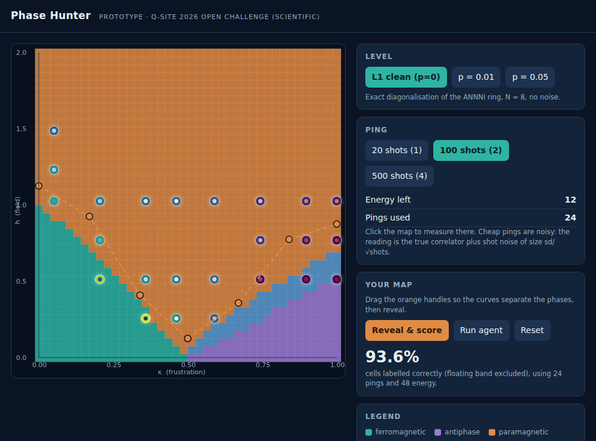

# Phase Hunter

**Q-SITE 2026 Open Challenge — Scientific Track (Quantum Coalition): mapping the ANNNI phase diagram under noise.**

Phase Hunter turns the challenge into a game. The (κ, h) phase diagram starts hidden under fog. You
spend a budget of *pings* — simulated measurements, with real shot noise — then draw where you think
the phase boundaries are, and the game scores your map against the analytic reference boundaries. An
AI agent plays the same map with the same budget. Each level raises the gate noise, so the phases
blur and shift while you hunt.

The game is the presentation layer. Underneath it is the required science: phase diagrams at
p = 0, 0.01 and 0.05, and an analysis of how noise moves the boundaries.

> **Status: draft submission (Sept 23, 2026).** The clean phase diagram and the playable prototype are
> done and reproducible from this repo. The noisy phase diagrams are not done yet — see
> [What is not done](#what-is-not-done-yet). Nothing in this README is a claimed result unless a
> script in this repo produced it.

---

## Current results

### Clean phase diagram (p = 0), N = 8 ring, exact diagonalisation


1600 ground states on a 40 × 40 grid over κ ∈ [0, 1], h ∈ [0, 2], solved in about **12 s**. Phases are
assigned by unsupervised clustering of two measured correlators, ⟨Z_i Z_{i+1}⟩ and ⟨Z_i Z_{i+2}⟩,
with the three cluster centres seeded at three corners of the plane whose phase is not in doubt. The
reference labels come from the analytic transition lines in the challenge handout.

| Metric | Value |
|---|---|
| Cell accuracy, floating band excluded | **92.3 %** |
| Cell accuracy, all cells (floating counted as an error) | 88.9 % |
| Cells inside the reference floating band | 3.6 % |

The disagreement is not scattered: it is a band just *above* the analytic lines, where our N = 8 ring
still shows order that the thermodynamic-limit formulas say has gone. That is the expected finite-size
rounding of a transition, and the handout warns the reference lines are qualitative at finite N. We
report it rather than tuning the classifier to match the lines.


### Playable prototype



Open `game/index.html` in a browser — no server, no build step. Click the map to ping, drag the orange
handles to draw your boundaries, press **Reveal & score**. Ping readings are drawn from the exact
ground-state statistics with Gaussian shot noise of size σ/√shots, so a 20-shot ping really can
mislead you and a 500-shot ping really is sharper.

**Run agent** plays a bisection baseline: for each of eight κ columns it pings at the midpoint in h,
asks whether the state still looks ordered, and halves the interval. In two test runs it used 24 pings and scored
**90.3 %** and **93.6 %** (the spread is shot noise). Those are two runs of a baseline, not a study —
the human-versus-agent measurement-budget experiment is still to come.

---

## What is not done yet

| Item | Status |
|---|---|
| Noisy phase diagrams at p = 0.01 and p = 0.05 | **Not done.** Code is written (`src/pennylane_pipeline.py`), not yet run. |
| PennyLane path executed | **Not done.** PyPI was unreachable from the machine that produced these figures, so PennyLane could not be installed there. The code is written and must be run with `scripts/run_pennylane.py --check` in the track environment before the final submission. |
| Measurement-budget study (human / grid / random / agent) | Not started. |
| Floating-phase detection | Not attempted. The handout calls it very hard at small N. |
| Writeup (2–3 pages) and presentation video | Not started. |

### Two honesty notes

1. **The noise levels in the game prototype are a placeholder.** `src/noise_preview.py` applies a
   single global depolarizing channel to the exact ground state, which simply scales the correlators.
   That is **not** the challenge's model (depolarizing noise on the target qubit after every CNOT,
   simulated on `default.mixed`). Levels built from it are labelled `preview_*` in the dataset and in
   the game UI, and no number from that model will be reported as a noise result.
2. **The current figures come from the numpy path**, `src/annni.py`. It builds and diagonalises the
   same dense Hamiltonian the starter kit's own `exact_diag.py` builds with numpy and
   `numpy.linalg.eigh`. `src/pennylane_pipeline.py` constructs the same Hamiltonian with
   `qml.dot`, and `scripts/run_pennylane.py --check` compares the two matrices element by element.
   The final submitted diagrams will come from the PennyLane path.

---

## How to run

```bash
# numpy path: scan the grid, classify, export the game dataset, render figures
python3 scripts/make_dataset.py --qubits 8 --grid 40
python3 scripts/make_figures.py

# the game: just open the file
open game/index.html

# PennyLane path (needs the Scientific Track environment)
uv sync --project "Scientific Track"
uv run --project "Scientific Track" python scripts/run_pennylane.py --check
uv run --project "Scientific Track" python scripts/run_pennylane.py --noise-pilot
```

## Repository layout

```
src/annni.py               exact ground states, correlators, per-shot standard deviations
src/reference.py           analytic boundaries and reference labels
src/classify.py            unsupervised phase classification + accuracy
src/noise_preview.py       PLACEHOLDER noise stand-in (clearly marked, not a result)
src/pennylane_pipeline.py  PennyLane Hamiltonian, VQE ansatz, noisy correlators on default.mixed
scripts/make_dataset.py    grid scan -> data/ + game/dataset.js
scripts/make_figures.py    figures/
scripts/run_pennylane.py   cross-check and noise pilot
game/index.html            playable prototype (no build step)
docs/Phase_Hunter_Plan.pdf full project plan: game design, levels, experiment, schedule
```

## The model

H = −Σ Z_i Z_{i+1} + κ Σ Z_i Z_{i+2} − h Σ X_i, on a ring (periodic boundaries), in the starter kit's
Z/Z/X convention. Nearest neighbours want to agree, next-nearest neighbours want to disagree
(frustration κ), and the transverse field h pushes every spin into superposition. The four phases are
ferromagnetic, antiphase (↑↑↓↓), paramagnetic, and the narrow floating phase.

One implementation detail worth flagging: the starter kit's `ising_transition(κ)` returns 0 at exactly
κ = 0, where the correct limit is h = 1. `src/reference.py` clamps κ away from zero so the left edge
of the grid is not mislabelled.

## Team

Tanish Singh Rajpal (Carnegie Mellon University, Information Networking Institute) — project lead.
Team roster to be completed at submission.

## References

1. Quantum Coalition, *QSITE 2026 Challenge — Scientific Track handout and starter kit*.
   https://github.com/benmcdonough20/QSITE-2026-QuantumCoalition — source of the Hamiltonian
   convention, the analytic transition lines (Ising, BKT, KT), the noise model, the deliverables and
   the judging rubric.
2. PennyLane demo, *Phase transitions of the ANNNI model*.
   https://pennylane.ai/qml/demos/tutorial_annni — phase definitions, VQE and QCNN approaches.
3. PennyLane challenge, *A Noisy Heisenberg Model*.
   https://pennylane.ai/challenges/heisenberg_model — the depolarizing-noise convention this track
   extends.
4. PennyLane documentation, `default.mixed` device and `qml.DepolarizingChannel`.
   https://docs.pennylane.ai
5. P. Bak and J. von Boehm, *Ising model with solitons, phasons, and "the devil's staircase"*,
   Phys. Rev. B 21, 5297 (1980) — background on the ANNNI phase structure.

Figures, code and text in this repository are our own work. The analytic boundary formulas and the
Hamiltonian convention are taken from reference 1 as the challenge requires.
