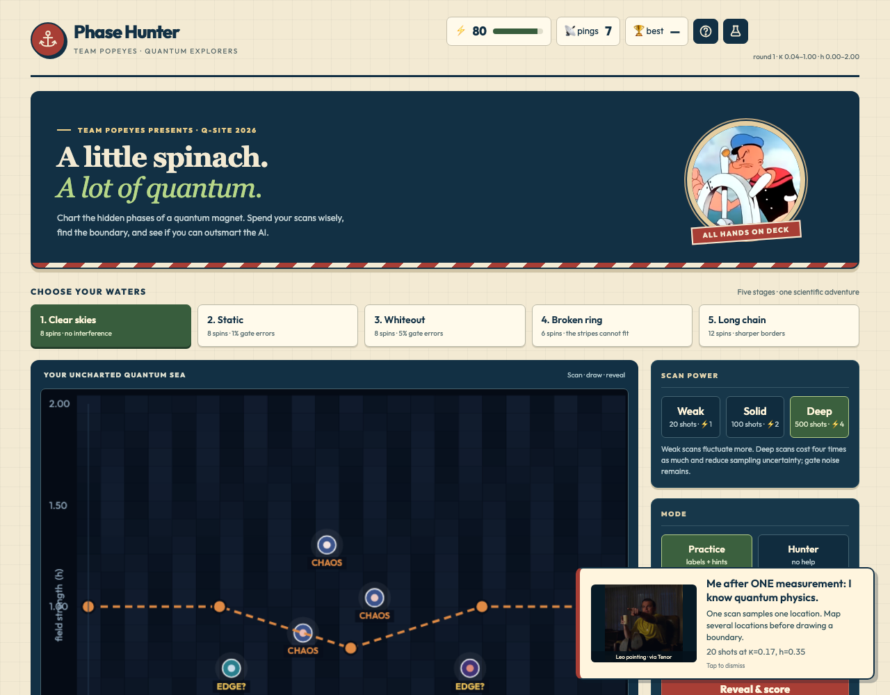
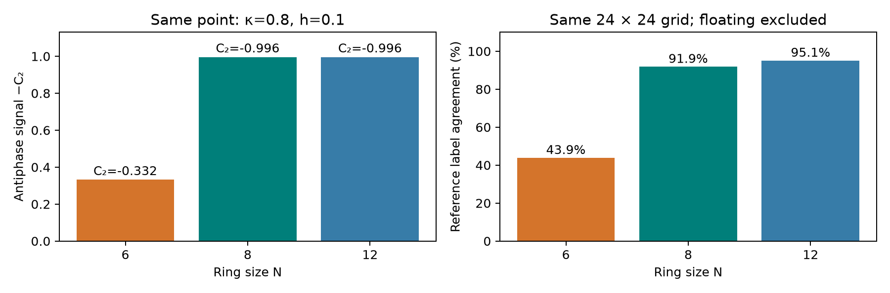
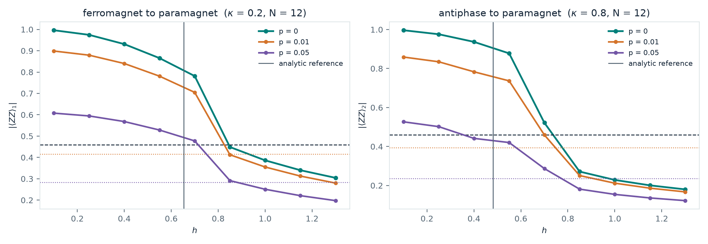
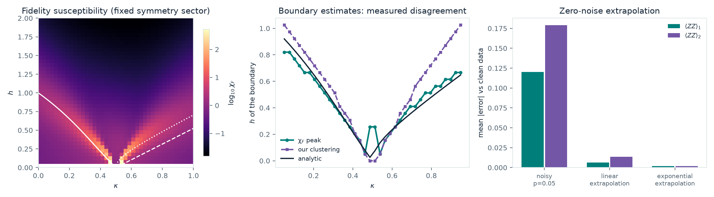

# Phase Hunter

**Team Popeyes (solo): Tanish Singh Rajpal**

Q-SITE 2026 · Quantum Coalition Scientific Track

Carnegie Mellon University, Information Networking Institute

**[Play the game](game/index.html)** — scan a hidden quantum phase map, spend a finite measurement budget, and try to beat the AI.



The game exposes a real inference problem: how much can you learn about a quantum magnet from a small number of noisy measurements? Drag five boundary handles, reveal your map score, and retry the same map to improve your strategy. No build step or account is needed.

<details>
<summary>Watch a current gameplay recording</summary>


</details>

## Submission artifacts

- [Executed scientific notebook](phase_hunter.ipynb): model checks, commensuration, noisy inference, shared readout, strategy comparisons, fidelity, mitigation and N=12 cuts.
- [Three-page writeup](docs/Phase_Hunter_Writeup.pdf).
- [Playable browser experiment](game/index.html).
- Presentation video: still to be recorded.
- Team roster: **Team Popeyes, solo — Tanish Singh Rajpal**.

## Questions and contributions

1. **Does the ring fit the order?** A six-spin ring frustrates the period-four stripe and strongly degrades the same classifier's reference agreement.
2. **What does gate noise change?** Separate signal attenuation from the response of a fixed or recalibrated inference rule.
3. **How should a player spend measurements?** Compare four strategies at exact equal budgets, using shared whole-register shots and 200 seeds.
4. **Does the noise observation extend to a larger ring?** Test two completed noisy cuts at N=12, including preparation error and threshold shifts.
5. **Can another diagnostic corroborate the map?** Compare fidelity-susceptibility peaks with clustering, and quantify where they disagree.

The underlying quantum states are simulated classically. There is no hardware result, quantum-speedup claim, or claim that this game is impossible classically.

## Model and observables

The periodic axial next-nearest-neighbour Ising model is

`H = -Σ ZᵢZᵢ₊₁ + κ Σ ZᵢZᵢ₊₂ - h Σ Xᵢ`.

The scan spans κ∈[0,1] and h∈[0,2]. Two site-averaged observables provide the fingerprint:

| Observable | Interpretation |
|---|---|
| C1 = meanᵢ ⟨ZᵢZᵢ₊₁⟩ | Large positive values indicate neighboring spins align. |
| C2 = meanᵢ ⟨ZᵢZᵢ₊₂⟩ | Large negative values identify the ++-- stripe signature. |
| Both small | Weak Z correlations, characteristic of the paramagnetic region. |

Three seeded k-means clusters start in known phase interiors. The analytic floating-band reference is excluded from primary scoring because the classifier does not independently detect it. Finite-size label agreement should not be confused with a thermodynamic transition measurement.

### Clean N=8 diagram

The 40×40 PennyLane grid contains 1,600 exact ground states. Agreement with the handout's reference is **92.28% excluding floating cells**, or **88.94% over all cells**. An independent NumPy implementation agrees to approximately 3×10⁻¹⁴ in energies and correlators.


### Commensuration: the distinctive six-spin failure

A perfect period-four `++--` stripe closes on a ring only when N is divisible by four. On N=6, enumeration gives the strict bound **C2 ≥ −1/3** for every Z-basis bitstring; a quantum expectation is a convex average and obeys the same bound. For N=8 and N=12 the lower bound is −1.

At the same antiphase-interior point, **κ=0.8, h=0.1**, the exact ground-state values and matched-grid classifier scores are:

| Ring size | Period four fits? | C2 | 24×24 reference agreement |
|---|---|---:|---:|
| 6 | No | -0.332 | 43.9% |
| 8 | Yes | -0.996 | 91.9% |
| 12 | Yes | -0.996 | 95.1% |



The N=6 result is finite-ring frustration and a limitation of this correlation-based classifier. It does **not** mean that the infinite-model antiphase disappears. Choose N divisible by four when testing an unfrustrated stripe; other sizes are useful controlled frustration experiments. These 24×24 game-grid scores differ from the denser 40×40 headline metric above.

[Quantitative data](data/commensuration.json) · Rebuild with `python scripts/analyse_size.py`.

## Gate noise: signal attenuation versus classification

The saved 24×24 N=8 scan fits a four-layer RY/RZ and CNOT-ring ansatz on `default.qubit`. Identical parameters are evaluated on `default.mixed` at p=0, 0.01 and 0.05. A target `DepolarizingChannel(p)` follows every CNOT. Keeping the prepared state fixed across noise strengths separates channel effects from preparation differences within each point.

| Noise p | Ordered area: fixed clean rule | Ordered area: recalibrated rule |
|---|---:|---:|
| 0.0 | 32.64% | 32.64% |
| 0.01 | 32.47% | 32.64% |
| 0.05 | 19.97% | 33.16% |

A fixed classifier labels about **39% less area as ordered at p=0.05**. Recalibration recovers most area, with small boundary changes: the cut near κ=0.30 shifts one h-grid step. This establishes sensitivity of inferred labels to noisy observables, not invariance of physical transitions under noise.


The selected antiphase interior loses about 47% of its order parameter versus 40% for the ferromagnetic interior. This is an empirical circuit-dependent comparison; distance alone is not isolated as its cause.

Preparation remains imperfect: mean energy error **0.149**, maximum **0.323**, and **443/576** points above 0.05. Mean correlator errors versus exact states are 0.027 and 0.042. Future scans retain the better warm/cold fit and save parameters; the archived expectation values used here remain unchanged.

## Whole-register shots: use all the information

Both correlators are diagonal in Z. A single shot measures the full register and produces one bitstring z. From it compute `C_d(z) = (1/N) Σ zᵢzᵢ₊d` for **both** distances.

- Every one of the 20, 100 or 500 shots contributes to both estimates.
- Site averaging is performed within each readout; sites are not assumed independent.
- Bitstrings with identical (C1,C2) are grouped into joint outcomes without losing information about these observables.
- A ping samples multinomial counts over those outcomes. Estimates remain bounded, and the shared-shot covariance is retained.
- The ping covariance is the per-shot covariance divided by the shot count.

Two independent binomials would discard the joint statistics. Likewise, borrowing clean-state standard deviations for noisy states is not justified. The notebook compares against a random-pair protocol that splits preparations between distances and discards simultaneous readouts and spatial averaging.

The noisy archive originally saved only means. `recover_readout.py` replays its deterministic fits, verifies each saved energy and noisy mean, then stores circuit parameters and joint outcome probabilities. Maximum recovery discrepancy is **1.2e-12**. No target accuracy was used to tune these distributions.

[Readout validation](data/readout_validation.json) · [Recovered distributions](data/readout_N8.npz) · [Sampling implementation](src/measurement.py).

## Measurement-budget study

Random, grid, bisection and adaptive sampling each receive exactly **6, 10, 16, 24, 36 or 50 pings**, at **100 whole-register shots per ping**, across **200 seeds**. Grid fills its entire budget; bisection distributes leftover scans across columns.

A fixed heuristic `max(C1,-C2)>0.46` labels each measurement. Three-nearest weighted voting reconstructs the map. Scores compare with each stage's cluster labels, excluding reference floating cells. This reconstruction differs from the game's five-handle line.


| Stage, 16 pings | Random | Grid | Bisection | Adaptive |
|---|---:|---:|---:|---:|
| Clear skies | 86.08% | 86.46% | 86.85% | 89.89% |
| Static | 86.74% | 90.28% | 89.50% | 91.28% |
| Whiteout | 84.07% | 89.08% | 84.76% | 89.18% |

### First tested budget reaching 90% mean agreement

| Stage | Random | Grid | Bisection | Adaptive |
|---|---:|---:|---:|---:|
| Clear skies | 36 | 24 | 24 | 24 |
| Static | 36 | 16 | 24 | 16 |
| Whiteout | Not reached | 24 | 24 | 24 |

These are crossings on a coarse budget ladder, not interpolated minimum costs or guarantees for an individual run. A strategy need not improve monotonically at every tested budget. Cross-stage changes mix noise, preparation and stage-specific classification; they do not isolate universal noise overhead.

### Borderline crossings

Any tested mean within **two standard errors of 90%** is flagged below, including points just below the line. Standard error is `sample SD / sqrt(200)`. Plot shading is **one standard deviation across runs**, not a confidence interval for the mean. The two-SE flag is an uncertainty screen, not a simultaneous confidence guarantee across all comparisons.

| Stage | Strategy | Pings | Mean | Standard error |
|---|---|---:|---:|---:|
| Clear skies | random | 36 | 90.37% | 0.20 pp |
| Clear skies | adaptive | 16 | 89.89% | 0.19 pp |
| Static | random | 24 | 89.62% | 0.24 pp |
| Static | grid | 16 | 90.28% | 0.18 pp |
| Whiteout | random | 50 | 89.80% | 0.18 pp |

[Full results and protocol](data/budget_study.json). Grid, bisection and adaptive sampling first reach 90% at 24 pings in Whiteout; random sampling remains below 90% through 50 pings, although its final mean is borderline. In Clear skies, all three structured strategies first cross at 24 versus 36 for random, whose crossing is also borderline.

## Larger-system extension: noisy N=12 cuts

The completed run contains **18 points: two nine-point cuts** at κ=0.2 and κ=0.8, h=0.1…1.3 with spacing 0.15. The four-layer variational circuit uses the same target-channel placement as N=8. This tests whether attenuation and inference sensitivity persist at larger N without claiming a full noisy N=12 phase diagram.

Fit one attenuation factor α per cut, then compare a fixed 0.46 threshold with the rescaled threshold α×0.46. Shifts below are relative to the same cut's p=0 crossing; a negative shift means a lower h. “No crossing” means the fixed threshold was not crossed in the sampled interval.

| κ | p | Attenuation α | Mean rescaling residual | Fixed shift Δh | Rescaled shift Δh |
|---:|---:|---:|---:|---:|---:|
| 0.2 | 0.01 | 0.904 | 0.0035 | -0.019 | 0.003 |
| 0.2 | 0.05 | 0.615 | 0.0080 | -0.131 | 0.037 |
| 0.8 | 0.01 | 0.855 | 0.0128 | -0.037 | 0.011 |
| 0.8 | 0.05 | 0.512 | 0.0276 | -0.383 | 0.036 |



Across the four cut/noise combinations, the largest mean residual after rescaling is **0.0276** and the largest available absolute rescaled-crossing shift is **0.037 in h**, compared with spacing 0.15. This supports approximate attenuation of these sampled observables to the extent shown by those residuals; it does not prove invariant thermodynamic boundaries.

N=12 preparation-energy errors are **0.186 mean** and **0.474 maximum**. Sparse interpolation, the chosen threshold and remaining fit error limit interpretation. This completed larger-system noise experiment is the evidence relevant to the rubric extension; credit is the judges' decision.

[Raw cuts](data/large_n_cut.json) · [Analysis](data/large_n_cut_analysis.json) · `python scripts/large_n_cut.py --analyse-only`.

## Independent diagnostic and mitigation

Fidelity susceptibility is calculated in a fixed translation-invariant, spin-flip-even sector, excluding h=0 from the stencil. For h>0 the unique positive ground state lies in this sector, avoiding arbitrary near-degenerate symmetry partners. No classifier labels enter the calculation.

Mean peak deviation from the analytic reference is **0.046 in h**, at spacing **0.051**. Mean disagreement with clustering is **0.128**: the methods do not agree within one grid step on average.



Two-point exponential extrapolation from p=0.01 and 0.05 reduces mean C1/C2 errors from **0.120/0.179** to **0.0019/0.0020**. The target is the **same variational state at p=0**, not the exact ground state. This infinite-shot experiment does not test finite-shot error amplification, unknown noise or hardware performance.

## Play, learn and replay

Five stages cover clean N=8, N=8 with 1% or 5% gate noise, frustrated clean N=6, and clean N=12. The N=12 game stage is clean; the larger-system noisy cuts above are a separate scientific experiment.

Practice supplies labels and 90 energy; Hunter removes hints and supplies 60. Weak/solid/deep scans cost 1/2/4 energy for 20/100/500 shots. The AI spends the same energy on the same map: 45 solid scans in Practice or 30 in Hunter. Its scans animate and remain visible until **Your turn — same map** restores the player's budget. Retry preserves the target; New map clears it.

The nautical theme uses chart paper, navy controls, sailor-red actions and spinach-green selections. Phase colors retain their scientific meaning.

**Personal memes** and **Famous meme GIFs** have independent switches. Both default on, alternating where both fit. Twelve GIFs and twenty-seven contextual captions attach short lessons to meaningful events. SUIII celebrates measured three-star results or AI wins; a no-scan reveal gets confused Travolta. Common events rotate through variants. Popeye supplies three fallback stills with thirteen captions.

<details>
<summary>Preview the current reaction library</summary>


</details>

The original personal recordings remain available. **Memes: off** removes reaction popups and result artwork; reduced-motion mode uses still GIF previews and manual personal playback. Media are credited separately from the software license: [GIF credits](game/assets/famous/CREDITS.md), [Popeye credits](game/assets/popeye/CREDITS.md).

## Reproduce

Use a fresh Python environment with `requirements.txt`; Jupyter is optional for opening the notebook interactively. The notebook builder executes and embeds every code cell without requiring Jupyter.

```bash
python -m pip install -r requirements.txt
python scripts/run_pennylane.py --check --qubits 8
python scripts/make_stages.py
python scripts/analyse_size.py
python scripts/analyse_noise.py --qubits 8
python scripts/budget_study.py
python scripts/second_method.py
python scripts/large_n_cut.py --analyse-only
python scripts/write_readme.py
python scripts/build_notebook.py
python scripts/make_writeup.py
python -m unittest discover -s tests -v
node tests/test_game.cjs
```

The shipped readout and exact-state caches make stage regeneration inexpensive. To independently recover the archived noisy distributions, remove the relevant recovery cache/output in a working copy and run:

```bash
python scripts/recover_readout.py --workers 2
```

This is the expensive step: it replays VQE preparation, checks every archived energy and mean, and writes resumable checkpoints. The output records its source archive hash. To rebuild the clean headline grid, run `python scripts/make_dataset.py --qubits 8 --grid 40 --backend pennylane`, then `python scripts/make_figures.py`.

To record the current interface:

```bash
python -m pip install playwright pillow
python -m playwright install chromium
python scripts/make_gifs.py
```

The recorder uses stable control IDs and measured element bounds, validates non-static frames, and writes `figures/gameplay.png`, `figures/gameplay.gif` and `figures/memes.gif`.

## Validation and limits

[Validation record](data/validation.json) documents Hamiltonian equality, clean-grid cross-checks and the archived scan hash. [Readout validation](data/readout_validation.json) documents recovered-state agreement. These are records tied to specific inputs, not automatically refreshed certificates.

Tests cover joint sampling means/variance/covariance, exact budgets, ring-size bounds, basis-invariant fidelity, better-fit persistence, visible AI progress, same-map handoff, reaction switches and victory conditions.

Remaining limitations: unresolved floating phase; finite-ring and VQE bias; heuristic inference rules; sparse larger-system cuts; no finite-shot mitigation experiment; no hardware run or quantum advantage. The presentation video remains to be recorded.

## Sources

- [Quantum Coalition Scientific Track handout and starter kit](https://github.com/benmcdonough20/QSITE-2026-QuantumCoalition/tree/main/Scientific%20Track).
- [PennyLane ANNNI tutorial](https://pennylane.ai/qml/demos/tutorial_annni).
- [Computational-basis probabilities (`qml.probs`)](https://docs.pennylane.ai/en/stable/code/api/pennylane.probs.html).
- [PennyLane DepolarizingChannel](https://docs.pennylane.ai/en/stable/code/api/pennylane.DepolarizingChannel.html).
